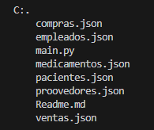

# TRABAJO DE README CON EJERCICIO PYTHON
Se realizo un ejercicio en donde se debia realizar un software para una farmacia

## General
Descripcion: El software permite navegar entre si mediante menus que muestran opciones especificas, el programa cuenta opciones de:

ventas:nos da diferentes opciones para registrar la venta

compra:el menu y diseño nos pide unos datos especificos para basarlo en una fase de datos 

uso: mediante las opciones que se da en los menus

## Funcionamiento

- Menus: cuenta con menus interactivos en donde estos le especifican al usuario las opciones disponibles dentro del programa

## Lenguajes usados

- Python

## Estructura del proyecto

## Caracteristicas
cuenta con 3 json:
 - json de medicamentos- cuenta con la informacion de los medicamentos y el stock

- json de pacientes-cuenta con la informacion de el cliente que compro el producto y del empleado que realizo la venta

- json de ventas-cuenta con la informacion del propvedor que surtio a la panaderia y de los productos que se compraron

- el archivo de main.py contiene el funcionamiento del software

- el json de empleado- cuenta con la informacion personal de el trabajador y que cargo tiene

- el json de proovedores cuenta con la informacion de este

- el json de compra cuenta con la informacion de las compras reañizadas 

## Diseño

- El diseño del software fue definido por una serie de requisitos propuestos en Notion
Instrucciones de uso
- ejecutar el programa desde la terminal de visual code o instalar la extension llamada code runer

# Desarrolado por
- jean franco guerrero acero, estudiante de Campusalands como trabajo de Readme con ejercicio Python